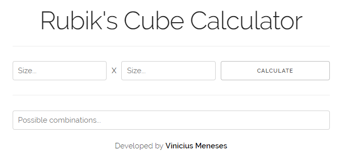
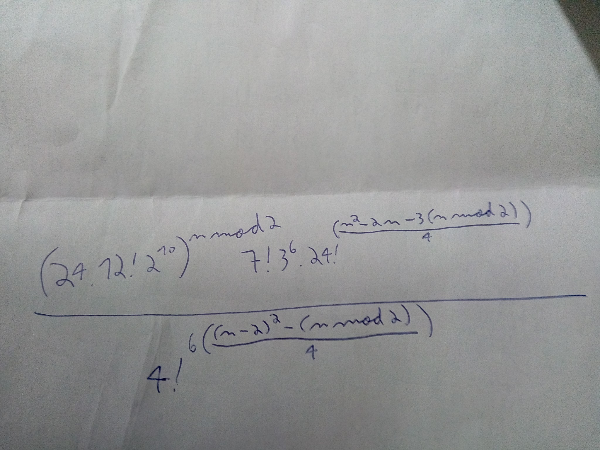

# rubiks-cube-calculator

> Minimalist calculator that shows the number of possible combinations of the Rubik's Cube

**rubiks-cube-calculator** shows the possible combinations depending of the Rubik's Cube size. It was developed by me for a friend using the following libraries:

- [Skeleton CSS Boilerplate](http://getskeleton.com/)
- [bignumber.js](https://github.com/MikeMcl/bignumber.js/)
- [Factorials](https://github.com/sankage/factorials)

[**Demo available here!**](http://rubiks-cube-calculator.surge.sh/)

  

## How is it calculated?

The possible combinations is calculated using the Rubik's Cube size typed in the formula below:

**n = Rubik's Cube size**

  

